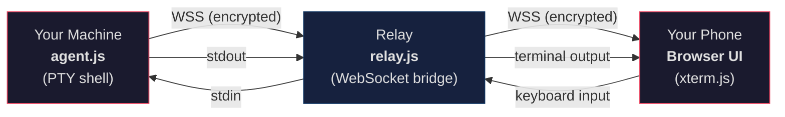
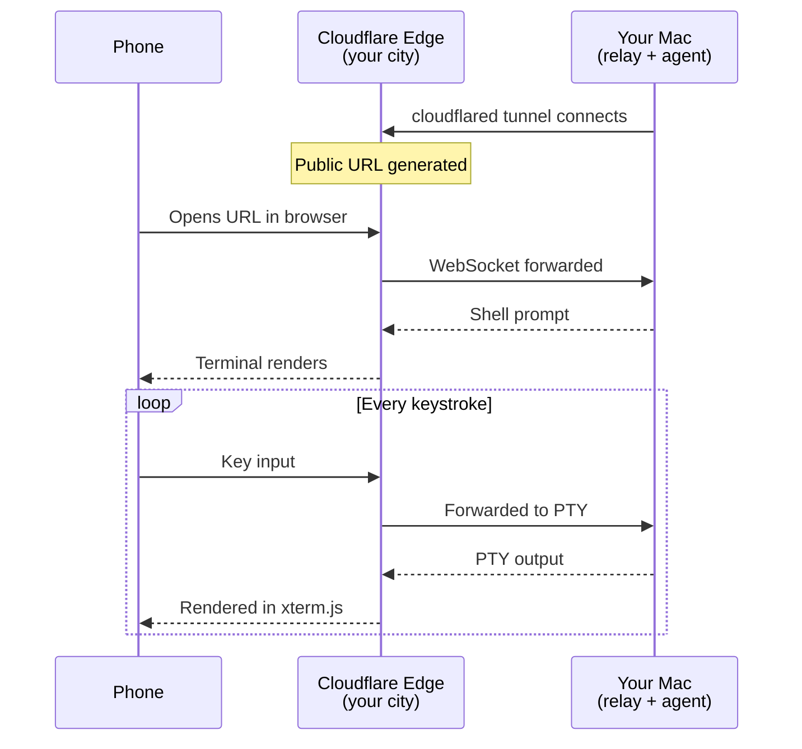
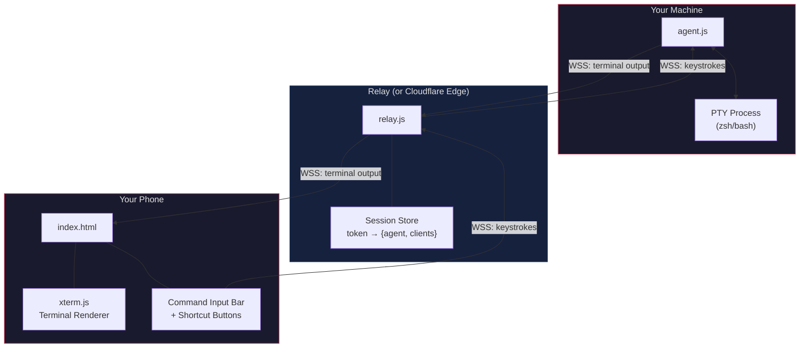
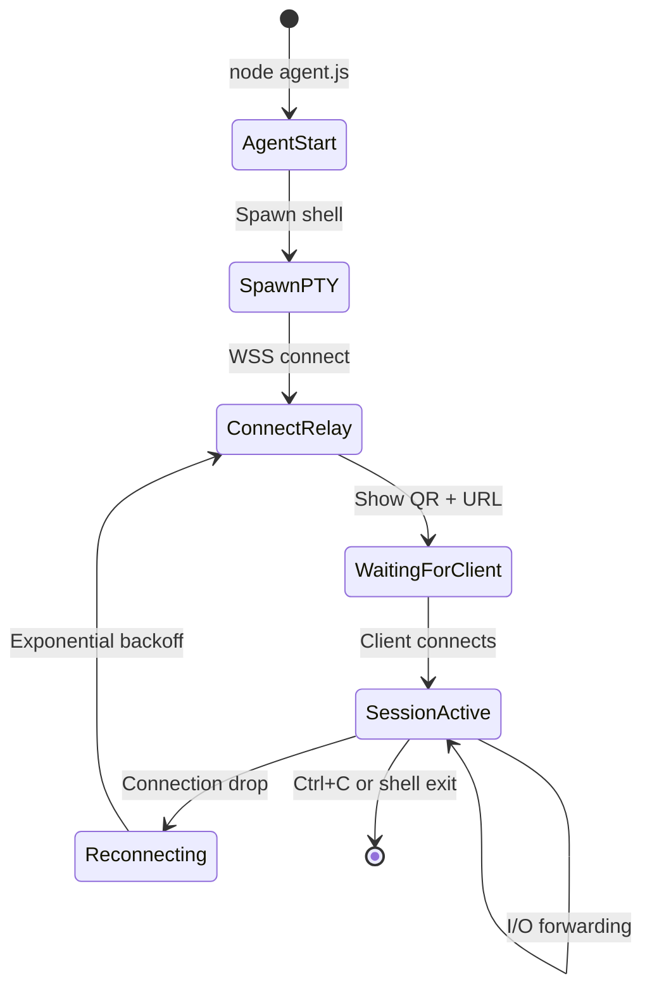

<p align="center">
  <h1 align="center">Open Tunnel</h1>
  <p align="center">
    <strong>Access your terminal from any device, anywhere.</strong>
  </p>
  <p align="center">
    Open-source remote terminal over the web. No subscriptions. No accounts. No VPN.
  </p>
  <p align="center">
    <a href="#quick-start">Quick Start</a> &middot;
    <a href="#cloudflare-tunnel-recommended">Cloudflare Tunnel</a> &middot;
    <a href="#deployment-options">Deploy</a> &middot;
    <a href="#architecture">Architecture</a> &middot;
    <a href="#security">Security</a>
  </p>
</p>

---

## What is Open Tunnel?

Open Tunnel lets you share your local terminal session over the web. Run one command, scan the QR code with your phone, and you have a full shell in your mobile browser.



### Features

- **One command to start** — `node agent.js wss://your-relay` and you're live
- **QR code connection** — Scan from your phone, no URL typing
- **Mobile-optimized UI** — Command input bar, shortcut buttons (Tab, Ctrl+C, arrows)
- **Full PTY emulation** — Colors, cursor, tab completion, vim, tmux — everything works
- **Auto-reconnect** — Both agent and client reconnect automatically on network drops
- **Cloudflare Tunnel support** — Sub-50ms latency through nearest edge node
- **Zero configuration** — No accounts, no API keys, no environment variables
- **Self-hostable** — Run the relay anywhere, or skip it entirely with Cloudflare Tunnel

---

## Quick Start

### Prerequisites

- [Node.js](https://nodejs.org/) v18+

### Install

```bash
git clone https://github.com/RagavRida/open-tunnel.git
cd open-tunnel
npm install
```

### Run

```bash
# Terminal 1 — Start the relay
node relay.js

# Terminal 2 — Start the agent (local relay)
node agent.js

# Or connect to a remote relay
node agent.js wss://your-relay-url.onrender.com
```

The agent prints a QR code and URL. Open it on your phone.

---

## Cloudflare Tunnel (Recommended)

The fastest deployment method. Cloudflare routes traffic through its nearest edge node — **no cloud server needed**, no account required, ~50ms latency.



### Install Cloudflare CLI (one-time)

```bash
brew install cloudflared          # macOS
# or: sudo apt install cloudflared  # Linux
```

### Usage

```bash
# Terminal 1 — Start relay locally
node relay.js

# Terminal 2 — Expose via Cloudflare (instant public URL)
cloudflared tunnel --url http://localhost:3100
# Output: https://random-words.trycloudflare.com

# Terminal 3 — Connect agent through the tunnel
node agent.js wss://random-words.trycloudflare.com
```

Scan the QR code on your phone — done.

### Latency Comparison

| Method | Route | Latency |
|---|---|---|
| **Cloudflare Tunnel** | Phone → Edge (your city) → Mac | **~50ms** |
| Render (free) | Phone → Oregon (US) → Mac → Oregon → Phone | ~800ms |
| Fly.io (Singapore) | Phone → Singapore → Mac → Singapore → Phone | ~100ms |
| Local WiFi | Phone → Router → Mac | ~5ms |

> **Tip:** The Cloudflare URL changes on each restart. For a permanent URL, set up a [named tunnel](https://developers.cloudflare.com/cloudflare-one/connections/connect-apps) (free with Cloudflare account).

---

## Cloud Deployment

For a persistent relay that's always available (no need to keep your Mac running Cloudflare).

### Render (Free Tier)

1. Push the repo to GitHub
2. [render.com](https://render.com) → **New** → **Web Service**
3. Connect your `open-tunnel` repo
4. Configure:

| Setting | Value |
|---|---|
| Build Command | `npm install` |
| Start Command | `node relay.js` |
| Instance Type | Free |

5. Deploy → get URL like `https://open-tunnel.onrender.com`

No environment variables needed.

### Fly.io

```bash
cd open-tunnel
fly launch --region sin    # Singapore (or maa for Mumbai)
fly deploy
```

### Self-Hosted

```bash
# On any server with Node.js
git clone https://github.com/RagavRida/open-tunnel.git
cd open-tunnel && npm install
PORT=443 node relay.js
```

---

## Architecture

### Project Structure

```
open-tunnel/
├── relay.js              # WebSocket relay + static file server
├── agent.js              # Local PTY agent with auto-reconnect
├── public/
│   └── index.html        # Mobile-optimized web terminal
├── package.json
└── README.md
```

### System Overview



### Component Details

#### Relay Server (`relay.js`)

- Express serves the web UI from `public/`
- WebSocket server with explicit HTTP upgrade (cloud-host compatible)
- Ping/pong keepalive every 30s (prevents idle disconnects)
- Session cleanup on agent disconnect
- Health check at `/health`, session debug at `/status`

#### Agent (`agent.js`)

- Spawns a PTY via `node-pty` (full xterm-256color emulation)
- Generates a 256-bit cryptographically random session token
- Displays QR code for instant phone connection
- Auto-reconnects with exponential backoff (1s → 30s, max 20 attempts)
- Sends fresh prompt when a new client joins

#### Web UI (`public/index.html`)

- [xterm.js](https://xtermjs.org/) terminal with fit addon
- **Command input bar** — visible text field for reliable mobile input
- **Shortcut buttons** — Tab, Ctrl+C, Ctrl+D, Up, Down, Esc, Clear
- Auto-connects when token is in URL query parameter
- Auto-reconnects on WebSocket drop (2s retry)

### Connection Lifecycle



### Protocol

All messages are JSON over WebSocket:

| Direction | Type | Payload |
|---|---|---|
| Agent → Client | `output` | `{ "type": "output", "data": "<terminal bytes>" }` |
| Client → Agent | `input` | `{ "type": "input", "data": "<keystrokes>" }` |
| Client → Agent | `resize` | `{ "type": "resize", "cols": 80, "rows": 24 }` |
| Relay → Agent | `client-joined` | `{ "type": "client-joined" }` |

---

## Security

### Threat Model

Open Tunnel is designed for **personal use** — accessing your own machine from your own phone. It is not designed for multi-tenant or enterprise use without additional hardening.

### Built-in Protections

| Layer | Measure |
|---|---|
| **Authentication** | 256-bit random token per session (32 hex bytes) |
| **Transport** | WSS (TLS) when deployed behind HTTPS or Cloudflare |
| **Session isolation** | Each token maps to exactly one shell session |
| **No persistence** | Sessions exist only in memory, destroyed on disconnect |
| **No stored credentials** | No passwords, cookies, databases, or user accounts |
| **Keepalive** | Ping/pong prevents stale connections from lingering |
| **Auto-cleanup** | All client connections close when agent disconnects |

### Recommendations

- Use HTTPS/WSS in production (Render and Cloudflare provide this by default)
- Never share session URLs publicly
- Stop the agent when done — the session terminates immediately
- For sensitive environments, add IP allowlisting at the relay or reverse proxy level

---

## Deployment Options

| Platform | Free | Latency | Account Needed | Best For |
|---|---|---|---|---|
| **[Cloudflare Tunnel](https://developers.cloudflare.com/cloudflare-one/)** | Yes | ~50ms | No | Daily use, lowest latency |
| **Local WiFi** | Yes | ~5ms | No | Same-network access |
| **[Render](https://render.com)** | Yes | ~800ms | Yes | Always-on relay (US) |
| **[Fly.io](https://fly.io)** | Yes | ~100ms | Yes (card) | Always-on relay (pick region) |
| **Self-hosted** | N/A | Varies | No | Full control |

---

## Tech Stack

| Component | Technology | Purpose |
|---|---|---|
| Relay server | Express + ws | HTTP server + WebSocket bridge |
| Terminal emulation | node-pty | Full PTY with xterm-256color |
| Web terminal | xterm.js + addon-fit | Browser-based terminal renderer |
| QR code | qrcode-terminal | Terminal QR for phone scanning |
| Tunnel | cloudflared (optional) | Public URL via Cloudflare edge |
| Runtime | Node.js v18+ | Server and agent runtime |

---

## Troubleshooting

| Problem | Cause | Fix |
|---|---|---|
| `Connection error: 404` | Relay not deployed yet | Wait 1-2 min for deploy to finish |
| `No active session found` | Agent not running | Start the agent: `node agent.js wss://...` |
| Connected but no prompt | Agent crashed or restarting | Check agent terminal, restart if needed |
| Typing but nothing appears | Mobile keyboard issue | Use the command input bar at the bottom |
| QR code won't scan | Terminal too small | Enlarge terminal window, or copy the URL |
| Agent keeps disconnecting | Idle timeout | Agent auto-reconnects; wait a few seconds |
| High latency | Relay in distant region | Switch to Cloudflare Tunnel |

---

## Roadmap

- [ ] Optional password protection for sessions
- [ ] Multiple concurrent sessions per agent
- [ ] File transfer between devices (upload/download)
- [ ] End-to-end encryption (beyond TLS)
- [ ] Clipboard sync between terminal and phone
- [ ] Native mobile app (React Native)
- [ ] One-line install script (`npx open-tunnel`)

---

## Contributing

Contributions welcome. See the [roadmap](#roadmap) for ideas, or open an issue.

```bash
git clone https://github.com/RagavRida/open-tunnel.git
cd open-tunnel
npm install
node relay.js     # Start hacking
```

---

## License

MIT

---

<p align="center">
  Built with the belief that accessing your own terminal shouldn't require a subscription.
</p>
